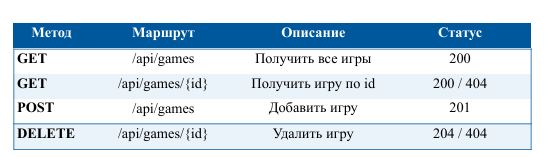
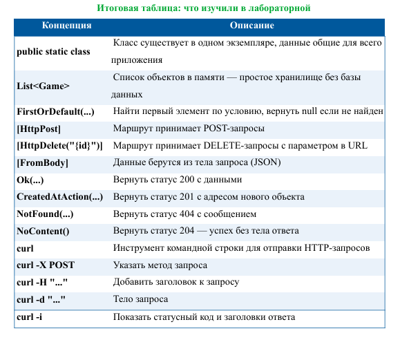

# Lab28_GamesList – Веб-сервер на ASP.NET Core (список любимых игр)

P.S: НИ В КОЕМ СЛУЧАЕ ЭТА РАБОТА И ВСЕ ПОСЛЕДУЮЩИЕ И ПРЕДЫДУЩИЕ НЕ НАПИСАНЫ С ПОМОЩЬЮ GPT И ТОМУ ПОДОБНОЕ!!! (ну практически, кроме README.md)

## Основная информация

- **ФИО:** Тотьмянин Тихон Алексеевич 
- **Группа:** ИСП-232 
- **Дата:** 28.04.2026  

Проект представляет собой REST API для управления списком любимых игр. Реализованы все CRUD-операции: получение всех игр, получение одной игры по ID, добавление новой игры, обновление существующей, удаление. Дополнительно добавлен эндпоинт для получения избранных игр и проверка на пустое название.

## Инструкция по запуску

```bash
cd GamesApi
dotnet run
```

## Таблица всем маршрутов:



## Что мы изучили в лабораторной работе:

